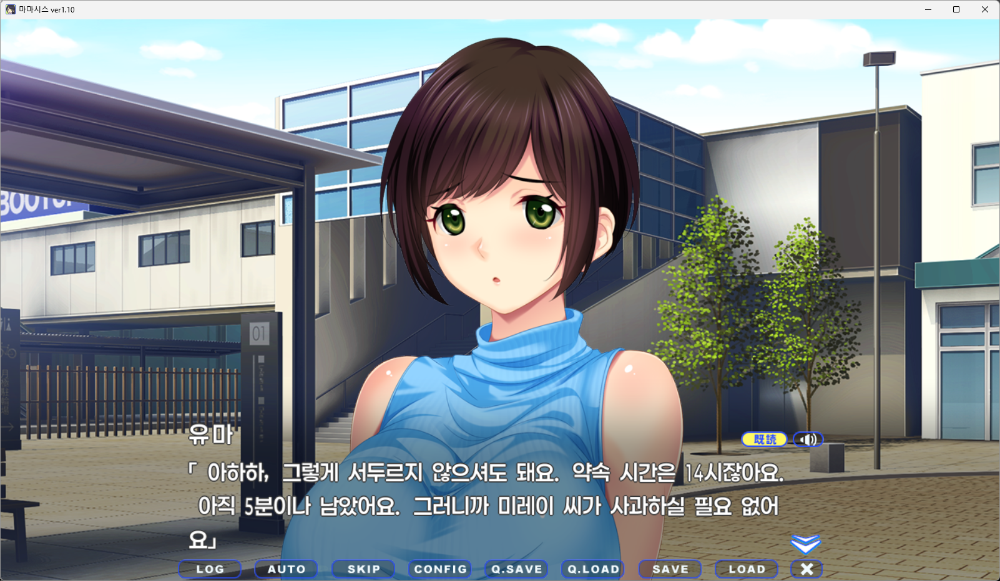
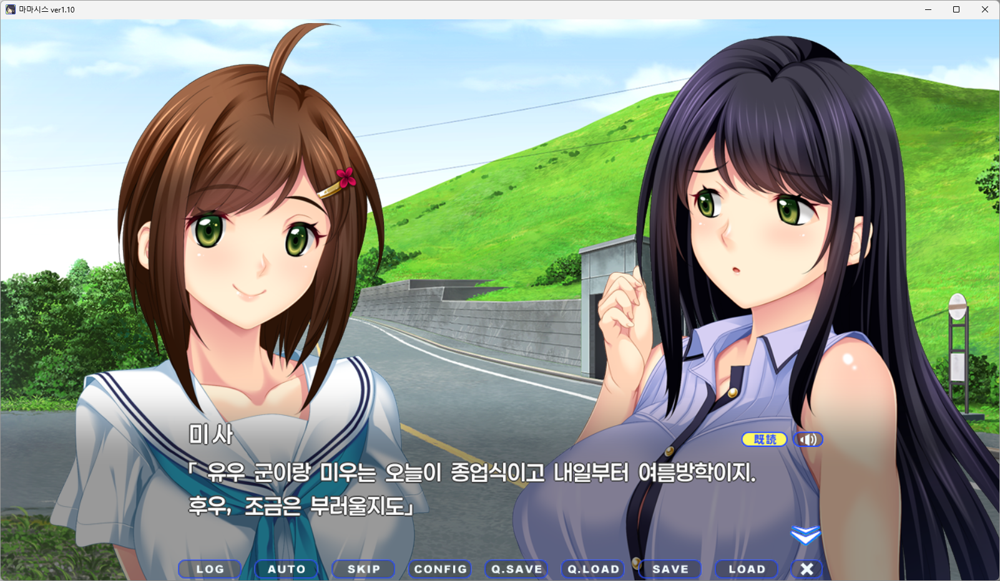

# 마마시스(まましす) 한글 패치

마마시스 본편과 DLC를 한글로 플레이할 수 있게 만든 패치입니다.
이미지는 미번역입니다.

**AI 번역: GEMINI 3.8 Flash 번역 / GPT 5.6 SOL 검수**

게임을 100% 플레이하면서 번역을 확인했습니다만, 게임이 재미가 없어 자잘한 수정은 하지 않고 넘어간 부분이 있습니다.





## 사용법

1. 게임을 종료하고 `MamaSisPatch.exe`를 `Mamashisu.exe`가 있는 게임 폴더에 넣습니다.
2. `MamaSisPatch.exe`를 실행하면 원본을 백업하고 같은 폴더에 한글 패치를 적용합니다.
3. 별도의 로케일 없이 같은 폴더의 `MamaSisKoreanLauncher.exe`로 게임을 실행합니다.

세이브는 그대로 사용합니다.
원본으로 복구하려면 `MamaSisPatch.exe`를 다시 실행하고 **1: 원본 복구**를 선택하세요.
복구에 필요한 `MamaSisPatch-backup.zip`은 삭제하지 마세요.

## GitHub에서 받기

이 저장소의 **Releases**에서 `MamaSis-KoreanPatch-Setup.zip`을 받으세요.

## 소스에서 직접 빌드하기

Windows에서 다음 프로그램을 설치합니다.

- Python 3.13 64비트
- Visual Studio Build Tools: **C++를 사용한 데스크톱 개발**, MSVC x86/x64 빌드 도구, Windows SDK

소스를 받은 폴더에서 PowerShell로 실행합니다.

```powershell
python -m pip install -r requirements-build.txt
.\font_hook\build.ps1
.\font_hook\build_launcher.ps1
python .\scripts\make_release.py
```

완성된 파일은 `dist/MamaSis-KoreanPatch-Setup.zip`입니다. 안에 있는 EXE 하나를 게임 폴더에 넣고 실행하세요.

## 라이선스

원본 게임과 리소스의 권리는 원저작권자에게 있습니다. 이 패치에는 원본 게임이 포함되지 않습니다.

포함된 [ReVN](https://github.com/Dir-A/ReVN)·[RxPJADV](https://github.com/ZQF-ReVN/RxPJADV) 도구와 Paperlogy 글꼴은 각각의 라이선스 및 배포 조건을 따릅니다.


## 번역 수정 방법

전체 소스의 `translation/final/messages.dlc.ko.json`에서 `msg_tra` 등 `_tra`로 끝나는 번역 필드를 수정합니다.
`_org` 원문, 항목 순서·개수, 제어 코드와 루비 표기(`\{표기|읽기}`), `sequences.*.json`은 유지하세요.
CP949로 표현할 수 없는 이모지 등은 사용할 수 없습니다.

통합본의 앞 23,026항목이 본편입니다. 통합본을 수정한 뒤 프로젝트 폴더에서 아래 명령으로 본편에도 반영합니다.

```powershell
python -c "import json,pathlib; p=pathlib.Path('translation/final'); d=json.loads((p/'messages.dlc.ko.json').read_text(encoding='utf-8')); (p/'messages.base.ko.json').write_text(json.dumps(d[:23026],ensure_ascii=False,indent='\t')+'\n',encoding='utf-8')"
```

DLL·런처가 아직 없으면 위의 C++ 빌드 명령을 먼저 실행합니다. 번역 수정 후에는 다음과 같이 빌드합니다.

```powershell
python .\scripts\make_release.py --game-dir "D:\Games\MamaSis"
```

이 경로에는 **패치 전 원본 본편·DLC 아카이브가 모두** 있어야 합니다. 이미 패치했다면 먼저 복구하세요.
수정 번역을 패킹·재추출하여 반영 여부를 확인하고 기준 해시를 갱신한 뒤 릴리즈 EXE를 만듭니다.
즉 JSON 수정 후 재빌드가 맞지만, 수정된 번역의 기준 해시도 함께 갱신해야 합니다.
갱신된 `manifest.json`과 JSON을 같이 GitHub에 올리면 Actions 빌드에도 적용됩니다.

## 폰트 수정 방법

현재 기본 폰트는 **Paperlogy 1.001 / 6 SemiBold**입니다. 다른 폰트를 넣기만 해서는 자동으로 선택되지 않습니다.

1. 사용할 한글 TTF를 `runtime/fonts/Paperlogy-6SemiBold.ttf`에 덮어씁니다. 다른 폰트라도 배포 파일명은 유지합니다.
2. `font_hook/font_hook.cpp`의 `HookCreateFontIndirectA()`에서 `Paperlogy 6 SemiBold`를 새 폰트의 **내부 글꼴 이름**으로 바꿉니다. 파일명과 내부 이름은 다릅니다. 현재 ANSI API를 사용하므로 영문 내부 이름을 권장합니다.
3. 필요하면 `lfWeight = 600`의 굵기와 `HookGetGlyphOutlineA()`의 영문·숫자 가로 비율 `58/100`도 새 폰트에 맞춰 조정합니다.
4. `.\font_hook\build.ps1`로 DLL을 다시 컴파일하고 `python .\scripts\make_release.py`로 배포 파일을 만듭니다. 번역도 바꿨다면 위의 `--game-dir` 옵션을 사용합니다.

기존 패치를 복구한 뒤 새 EXE로 설치하세요. 폰트 변경 후 줄바꿈·글자 겹침은 직접 확인해야 합니다.
폰트는 해당 제작자가 허용하는 수정·재배포 조건을 따라야 합니다.

## 자유 배포·수정 허용

이 프로젝트의 자체 작성 패치 코드와 권리를 보유한 번역 기여분은 **MIT 라이선스**로 자유롭게 사용·수정·재배포할 수 있습니다.
재배포 시 저작권 고지와 [LICENSE](LICENSE)를 포함해 주세요. 원본 게임의 대사·리소스, 외부 도구와 폰트에 대한 권리는 별개이며 해당 권리자의 조건을 따릅니다.
